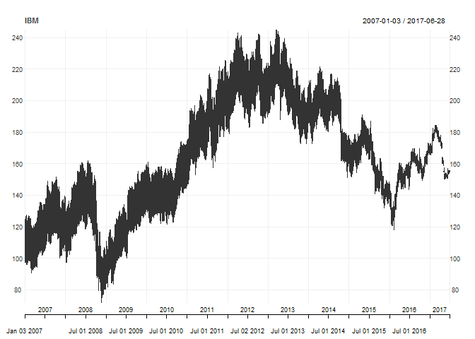
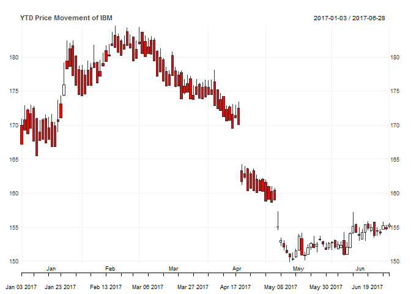
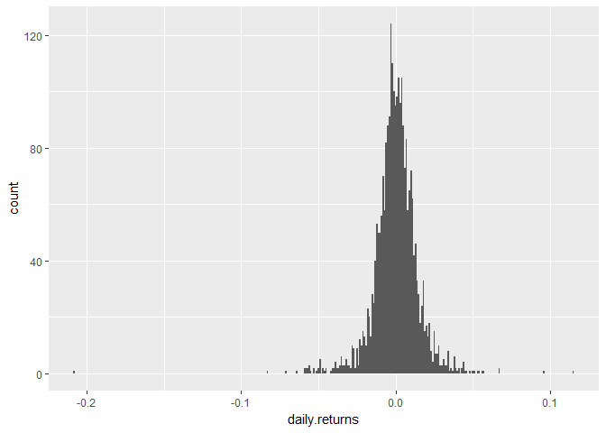

# Quantmod_R_Financial-Analysis_Rmarkdown
Jack K. Rasmus-Vorrath  
June 29, 2017  

#The following presents a simple walkthrough analysis and visualization of time series financial data on IBM stock performance using the 'quantmod' package in R to interface with the Yahoo Finance API.

##The required packages for the workflow include 'quantmod' and 'tidyverse'. Necessary dependencies 'xts', 'TTR', and 'zoo' will load along with these libraries.

###Note that possible conflicts with preloaded packages may result.


```r
library(tidyverse)
```

```
## Loading tidyverse: ggplot2
## Loading tidyverse: tibble
## Loading tidyverse: tidyr
## Loading tidyverse: readr
## Loading tidyverse: purrr
## Loading tidyverse: dplyr
```

```
## Conflicts with tidy packages ----------------------------------------------
```

```
## filter(): dplyr, stats
## lag():    dplyr, stats
```

```r
library(quantmod)
```

```
## Loading required package: xts
```

```
## Loading required package: zoo
```

```
## 
## Attaching package: 'zoo'
```

```
## The following objects are masked from 'package:base':
## 
##     as.Date, as.Date.numeric
```

```
## 
## Attaching package: 'xts'
```

```
## The following objects are masked from 'package:dplyr':
## 
##     first, last
```

```
## Loading required package: TTR
```

```
## Version 0.4-0 included new data defaults. See ?getSymbols.
```

##The IBM NYSE ticker ('IBM') can be identified with a simple search on the home page for Yahoo Finance. 

##The quantmod function to retrieve the price data is 'getSymbols()'.


```r
getSymbols("IBM")
```

```
## 'getSymbols' currently uses auto.assign=TRUE by default, but will
## use auto.assign=FALSE in 0.5-0. You will still be able to use
## 'loadSymbols' to automatically load data. getOption("getSymbols.env")
## and getOption("getSymbols.auto.assign") will still be checked for
## alternate defaults.
## 
## This message is shown once per session and may be disabled by setting 
## options("getSymbols.warning4.0"=FALSE). See ?getSymbols for details.
```

```
## 
## WARNING: There have been significant changes to Yahoo Finance data.
## Please see the Warning section of '?getSymbols.yahoo' for details.
## 
## This message is shown once per session and may be disabled by setting
## options("getSymbols.yahoo.warning"=FALSE).
```

```
## [1] "IBM"
```

##A first look at the retrieved dataframe consisting of 2641 rows (the number of trading days since IBM's IPO) and 6 variables (open price, high price, low price, close price, volume, and adjusted) is produced with the function 'glimpse()'. Tabular data on the first 6 rows is presented with the head() function. 

###'Volume' corresponds to the number of transactions. The discrepancy between 'Adjusted' and 'Close' reflects any share splits or rights issues.


```r
glimpse(IBM)
```

```
## An 'xts' object on 2007-01-03/2017-06-28 containing:
##   Data: num [1:2641, 1:6] 123 123 123 124 125 ...
##  - attr(*, "dimnames")=List of 2
##   ..$ : NULL
##   ..$ : chr [1:6] "IBM.Open" "IBM.High" "IBM.Low" "IBM.Close" ...
##   Indexed by objects of class: [Date] TZ: UTC
##   xts Attributes:  
## List of 2
##  $ src    : chr "yahoo"
##  $ updated: POSIXct[1:1], format: "2017-06-29 23:10:47"
```

```r
head(IBM)
```

```
##            IBM.Open IBM.High IBM.Low IBM.Close IBM.Volume IBM.Adjusted
## 2007-01-03  122.782  124.323 121.619     97.27    9196800     76.98791
## 2007-01-04  122.870  124.816 122.403     98.31   10524500     77.81103
## 2007-01-05  123.312  123.754 122.440     97.42    7221300     77.10663
## 2007-01-08  124.449  125.713 124.260     98.90   10340000     78.27800
## 2007-01-09  125.182  126.761 125.170    100.07   11108200     79.20407
## 2007-01-10  124.449  125.144 123.729     98.89    8744800     78.27012
```

##A line chart visualization of quantmod is produced with the function 'chart_Series()'.


```r
chart_Series(IBM)
```

<!-- -->

##A candlestick chart can be produced by default when year-to-date data is requested.

```r
chart_Series(IBM['2017::'], name = "YTD Price Movement of IBM")
```

<!-- -->

##Identifying the highest recorded price of a time series is made possible with the function 'seriesHi()'.


```r
seriesHi(IBM)
```

```
##            IBM.Open IBM.High IBM.Low IBM.Close IBM.Volume IBM.Adjusted
## 2013-03-15  244.335  244.925   242.1    214.92    7930300     189.4507
```

##The calendar year market rate of return is produced with the function 'yearlyReturn()'.

```r
yearlyReturn(IBM)
```

```
##            yearly.returns
## 2007-12-31    -0.11957780
## 2008-12-31    -0.22146156
## 2009-12-31     0.55537058
## 2010-12-31     0.12116120
## 2011-12-30     0.25293003
## 2012-12-31     0.04171197
## 2013-12-31    -0.02077784
## 2014-12-31    -0.14463936
## 2015-12-31    -0.14223390
## 2016-12-30     0.20614744
## 2017-06-28    -0.06428097
```

##Histograms displaying the distribution of daily returns can be produced by passing the object returned by the 'quantmod' function 'dailyReturn()' to functions of the 'ggplot' package.


```r
IBM_daily <- dailyReturn(IBM)
ggplot(IBM_daily) + geom_histogram(aes(x = daily.returns), binwidth = .001)
```

<!-- -->


#The 'quantmod' function thus simplies interfacing to finance APIs and makes preliminary analyses and visualizations of time series data easy!


